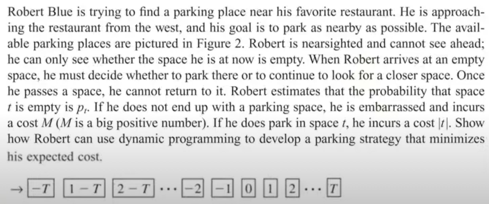

# car-parking-with-reinforcement-learning
Q-learning application to find an optimal parking slot

This study aims to solve the parking issues faced by drivers in cities by proposing a framework based on Reinforcement Learning (RL).

Consider an individual who commutes to work and wants to find a parking spot close to their office/target place. They approach from the east and desire a spot as close as possible. However, their visibility is limited, and they can only assess the availability of parking spots at their current location. They must decide whether to park in the current spot or continue searching for a closer one, weighing the benefits against the additional time and effort required.

Existing solutions to this problem rely on technologies like smart cameras and sensors, but they are heavily dependent on the performance of applications and detection models. This project seeks to reduce these dependencies by adopting a game-like approach to parking, where uncertain results can be learned through reinforcement learning. 

You can find this problem in this [Operation Research][book]* book, in the Probabilistic Dynamic Programming section. So, the problem is tried to solve by various methods and applications. You can find the problem definition placed in the book below. You can find the demo of probabilistic dynamic programming approach for this study in the [‘probabilistic-dp.ipynb’][prob] Jupyter Notebook.

**Winston, Wayne L. Operations research: applications and algorithms. Cengage Learning, 2022.*

[book]: https://www.academia.edu/48990438/Operational_Research_Winston_Wayne
[prob]: https://github.com/ftmoztl/car-parking-with-reinforcement-learning/blob/main/Codes/probabilistic-dp.ipynb

# Methods & Algorithms
In this approach, in the car parking problem, the agent (our actor) would take actions (park or move forward to find a more close parking slot) and receive rewards (e.g., parking done in a short time and closest area to the target) from the user. The nature of this problem is interactive, sequential, and agent-based. Because the agents want to go to the same place each day and make a decision as to what to do. Actually, this problem is placed in the ‘Operation Research’ book written by Wayne L. Winston [2]. The probabilistic dynamic programming proposed to solve this problem is in this book. But, the dynamic programming approach is efficient when the number of states and actions is manageable. On the other hand, Q-learning is more flexible and can handle larger state spaces and unknown transition probabilities. It is suitable when the state space is large or continuous, and the transition probabilities are unknown or difficult to model. If the real locations and target places are considered, there will be a huge amount of state space with the coordinates of the agents, and places. So, Q-learning was decided to use. The agent can then update its Q-values based on the rewards received, using the Q-Learning update rule. The important features of the Q-learning, especially for this problem;
* It is well-suited for problems where an agent learns to make sequential decisions in an environment to maximize a long-term reward. The parking problem involves making a series of actions (movements and parking) to reach a target location that aligns well with the reinforcement learning framework.
* Q-learning is a model-free algorithm, meaning it does not require prior knowledge or explicit knowledge of the environment dynamics. In the parking problem, it might be difficult or impractical to obtain an accurate model of the parking lot, obstacles, and agent dynamics. Q-learning allows the agent to learn directly from interactions with the environment, making it more flexible and applicable to real-world scenarios.
* Q-learning incorporates the exploration-exploitation trade-off, which is crucial in solving complex problems. During the learning process, the agent explores different actions to gather information about the environment and discovers the best actions to exploit for maximizing rewards. This is particularly relevant in the parking problem, where the agent needs to explore different paths and parking spots before learning the optimal strategy to park in the most suited place.
* Q-learning employs value iteration to iteratively update the Q-values, which represent the expected rewards for taking specific actions in specific states. By iteratively
6
refining the Q-values, the agent learns the optimal policy for parking in different situations. This iterative process allows the agent to gradually improve its performance and converge to an optimal solution. Actually, Q represents quality. So the agent will learn quickly and consciously by updating the Q table with mote qualified results of the action.
* Q-learning can handle problems with large state and action spaces, making it suitable for complex parking scenarios with multiple parking spots, varying target locations, and obstacles.
The actors of the environment are below;
➔ Agent: Car or car driver,
➔ Actions: 5 actions are available, turn left, turn right, go up and down, park,
➔ States: Location of the agent with parked or not parked,
➔ Environment: The focus area includes the target place, and it will include restrictions that can be on the road (lines that indicate the out of road, traffics, etc.) Rush hour will be an important factor for the specific road and cause traffic on the road.
➔ Reward: Regular movement rewards with constants and parking rewards with closeness to the target.
The simulation environments were developed to create this restricted environment with these factors. It is assumed that each resource, each driver, and each destination has a known location associated with it in a 2–dimensional Euclidean space as indicated in this study [5]. Q-learning values are kept to store the information that is learned. The agent can update its Q-values based on the rewards received, using the Q-Learning update rule.

# Learning Environment Creation

# Hyperparameter Tuning 

# Visualization
The agent movements are visualized by using the ‘pillow’ package of Python. It’s adapted to the 20x20 field. A function is created to visualize roads, agents, parking lots, and target places. You can find in the visualization-traffic.ipynb notebook.

# Additional Studies

# Environment
All development processes are done in a Python environment. The environment Python script and field classes are created to constitute environments for the agent and learning process. And also for visualization of the agent movement, the ‘pillow’ Python package was used.

To install the dependencies to run the notebook, you can use Anaconda. Once you have installed Anaconda, run:

`$ conda env create -f environment.yml`
# Proposed Resources

# Contribution
If you want to contribute please, send your pull request. All contributions are welcome!

#
Please check that repository for updates, for opening issues or sending pull requests.